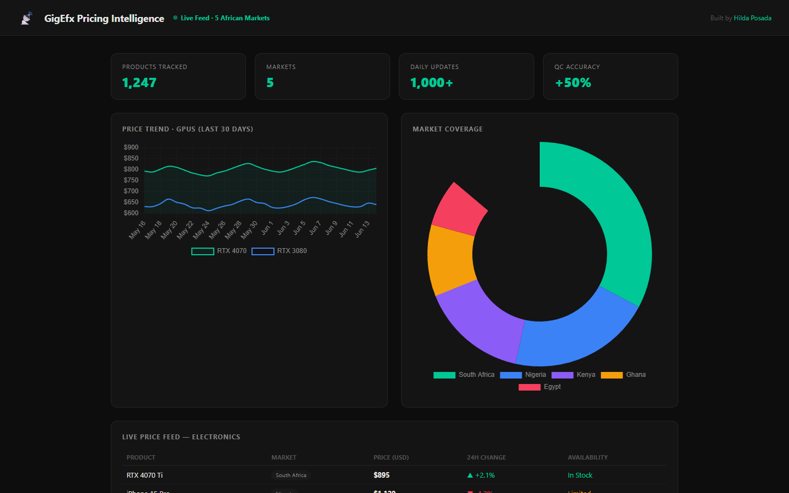

# GigEfx Pricing Intelligence

## Verified deployment status · October 1, 2026

The [web demo](https://gigefx-demo.vercel.app/) displays seven fixed example products and an illustrative chart. It is not connected to the scraper or a current retailer feed. Random price updates were removed. Live collection and data quality claims are not verified by this demo.

See [deployment source and scope](web/README.md) and the [portfolio audit](https://github.com/HildaPosada/hildaposada.github.io/blob/main/docs/project_audit.md). Historical descriptions below are not evidence of a connected production backend.


> **[Live Demo](https://gigefx-demo.vercel.app)** | Real-time pricing database tracking 1,247 products across 5 African markets.



---

## The Problem

Price scouting across African electronics markets is manual, slow, and inconsistent. Vendors in South Africa, Nigeria, Kenya, Ghana, and Egypt each have different pricing, availability, and update cadences. GigEfx centralizes this into a single intelligence layer.

## What I Built

- Web scraper collecting pricing data from third-party vendors across 5 markets
- Centralized database storing 1,247+ product records with 24h change tracking
- Price trend charts: 30-day GPU pricing with multi-product comparison
- Market coverage breakdown: South Africa, Nigeria, Kenya, Ghana, Egypt
- Live price feed with availability status and change indicators
- 50% QC accuracy improvement over manual scouting baseline

## Key Results

| Metric | Value |
|--------|-------|
| Products Tracked | 1,247 |
| Markets Covered | 5 |
| Daily Price Updates | 1,000+ |
| QC Accuracy Improvement | +50% |

## Skills Demonstrated

`Python` `Web Scraping` `SQL` `Data Pipeline` `Price Intelligence` `Chart.js`

## How to Run

```bash
pip install -r requirements.txt
python scraper.py
```

## About

Built by Hilda Posada | MS Organic Chemistry, CSULB | Omdena ML Lead
[LinkedIn](https://linkedin.com/in/hildaposada) | [GitHub](https://github.com/HildaPosada) | [Portfolio](https://hildaposada.github.io)

